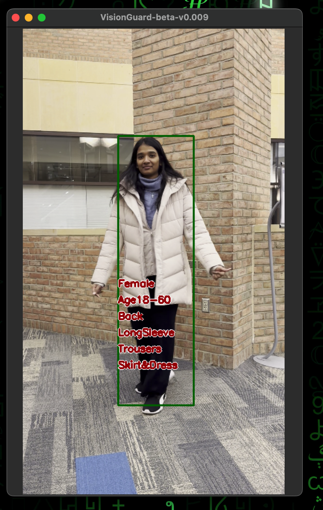

# VisionGuard 
## Enhancing Video Surveillance through Pedestrian Attribute Recognition

### Executive Summary:
```text
VisionGuard proposes a Pedestrian Attribute Recognition system designed for video surveillance and
security applications. In the realm of video surveillance, the challenge was to elevate the capabilities
beyond basic object detection. Through various computer vision techniques, we aimed to recognize
and categorize intricate pedestrian attributes such as clothing, accessories, age and gender. This
was done by employing a fusion of YOLO for object detection and the SWIN transformer and a
custom decoder for robust feature extraction. We created a graphical user interface (GUI) application
using the Tkinter library for real-time video processing and analysis. Our model was effective in
live demonstrations and detected pedestrians consistently along with recognizing their attributes, and
overlaying this information onto the video feed. The experimental results indicated the successful
implementation and practical viability of VisionGuard in real-world scenarios. 
```

### How to run 
#### First install required packages in your preferred env or directly create one
```bash
pip install -r requirements.txt
```
#### After you have created env you can run it with
```bash
python ui/app.py --vid "Absolute path of video file"
```
### Demo

https://github.com/ayushsaklani/visionguard/assets/19391609/57010bdb-240e-47ef-af3d-65885b36d06d

### Results
Below are the results from our app ui. 

<table>
<tr>
<td>


</td>
<td>


</td>
</tr>
</table>
